When we first open the executable, we are greeted with a message as shown below

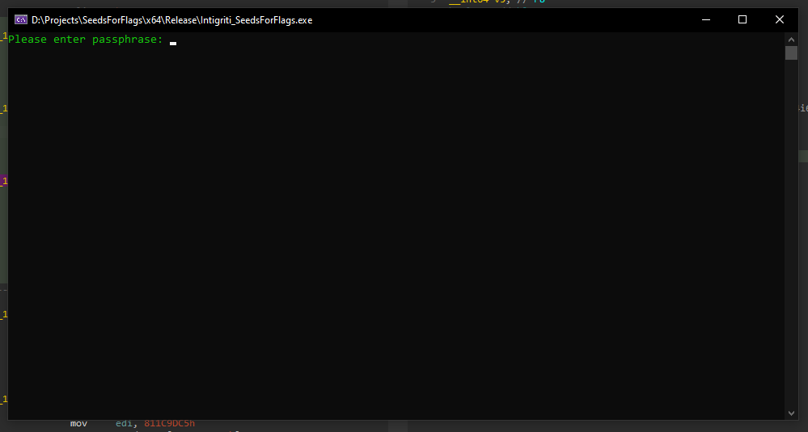

We are asked to enter a passphrase. After entering some random text I am prompted with the message "Invalid passphrase"
and the application exits with exit code 1.

## Decompiling time

Time to load up IDA and see what this executable is hiding, at first look there is not much going on as the `main` function is rather simple.

But after closer inspection of the `main` function, we stumble upon the first piece of trickery

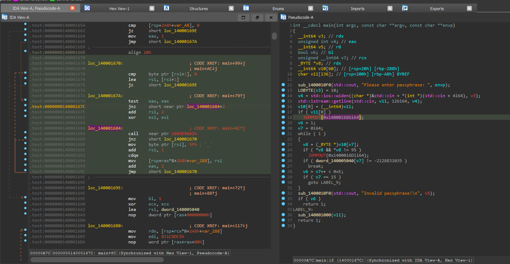

In the above screenshot, we can see our decompiled output is giving somewhat invalid/unexpected results.
The disassembler view on the left side is synced with the decompiled output, after clicking on the 'invalid' `JUMPOUT` line
we see the assembly on the left is doing something unexpected.

### Oldest trick in the book

The `jnz short near ptr loc_140001684+2` is jumping inside the `call near ptr 1603E96A1h` instruction.

at this point, a somewhat experienced reverse engineer will take a closer look and decide if we are
dealing with 'dead code' by examining the condition of the jump. We can see `test eax,eax` being used to make the decision
but a few instructions above that we see `mov eax, 1`. This means `eax` will most likely never be `0` at the point of the
branch instructions and we can patch out the 'dead' code as seen below.

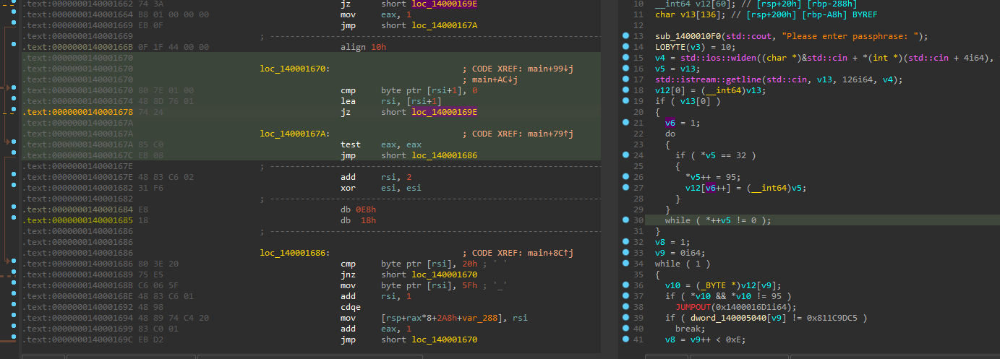

And there we go, after patching the `jnz` to `jmp` I decompiled the function again and this time IDA did not bother disassembling
the junk bytes as they are now considered dead code.

We can now also see that `eax` equals variable `v6` in the decompiler output, this will come in handy soon.

## Moving on

The same trick is used near the end of the function:

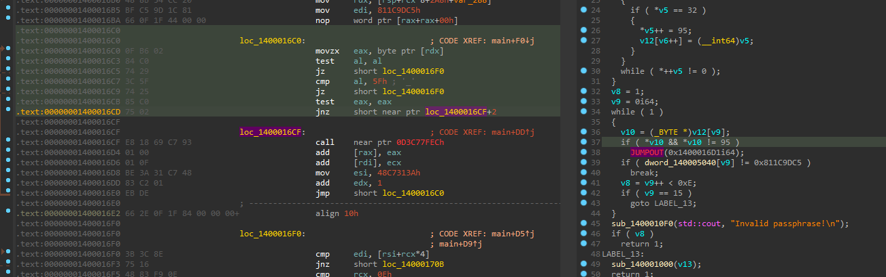

Which we will also patch to `jmp` and decompile again:

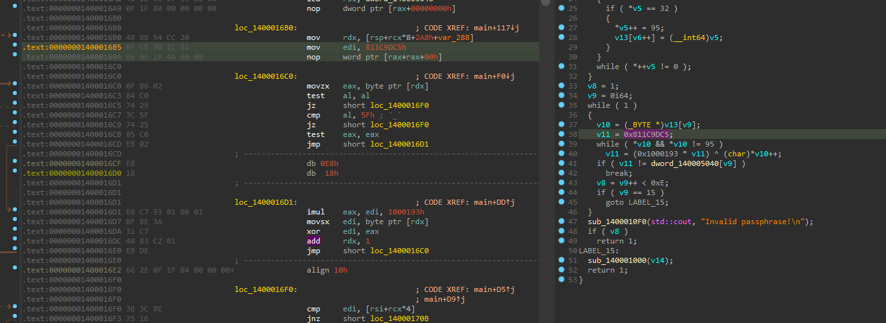

Leaving us with a nice and clean pseudo code.

## Same ol' reversing

This is where things get boring, but a skilled reverse engineer will get through this part in his own way.

### Look at it differently

One might interpret data in different ways. For example, the last function in `main` looks like this:

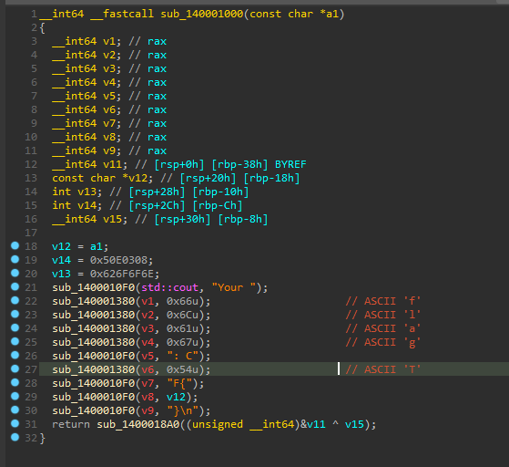

Interpreting these bytes as ASCII will eventually reveal the string "Your flag: CTF{", indicating that this function will be used to spit out the flag.

Also note that, when reversing the first section of `main`, we will see a value being checked against `0x20` and if true, it will be replaced by `0x5F`.
This pointer is then saved in an array which later on seems to be used during the hashing.

The hashing process will stop hashing when a `0x00` or `0x5F` is present.

This all makes sense once you find out `0x20` is ASCII whitespace and `0x5F` is ASCII underscore.

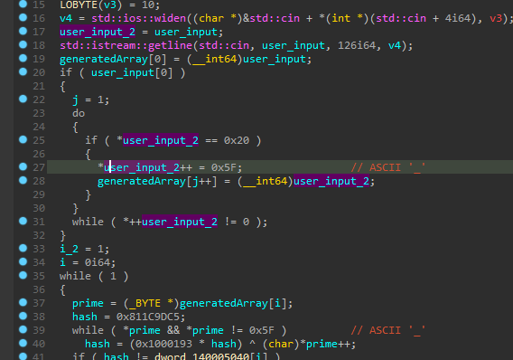

### Just google

One may google the 2 DWORD's used at the end of the function (0x811C9DC5, and 0x1000193) to find this Wikipedia article on the FnV32 article https://en.wikipedia.org/wiki/Fowler%E2%80%93Noll%E2%80%93Vo_hash_function
That article contains pseudo-code which will be very helpful to figure out what's going on.

By simply renaming some variable according to the FnV32 Wikipedia article we can see a suspicious array being used that seems to check generated hashes against hardcoded ones.

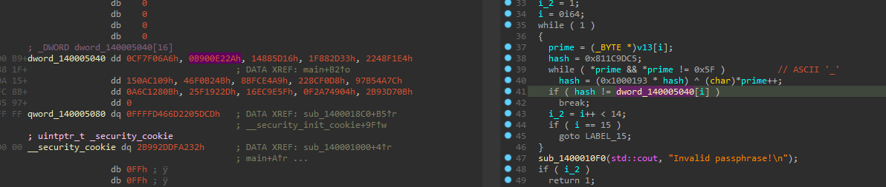

## The Guess-fest

At this point we know the challenge is named something like 'BitcoinsForFlags', the executable asks for a 'passphrase',
the list of hardcoded hashes is exactly 15 DWORD's and our input buffer from `stf::isteam::getline(std::cin, v14, 126, v4)` is exactly 126 bytes long.

This is the point one should realize a `BIP-39` recovery seed is being used.
_(NOTE: if this is too much of a guess-fest it's always possible to change the "Please enter passphrase:" message with something more obvious)_

# Creating a rainbow table

Once we figured out those hardcoded secrets are just FnV32 based `BIP-39` words, we can download the 2048 word wordlist and start hashing them.

Because I am a big fan of C# I simply copy-pasted the pseudo-C code from IDA into a new C# project and then tweaked it so the hashing is exactly as in our executable.

Since the hashing algorithm is exactly the one on Wikipedia we could also use an already existing or online tool,
but from my experience, most of the time such hashing algorithms are slightly modified (especially in malware) to prevent the usage of common/existing tools.

Anyway, I quickly threw together a bunch of C# code that's capable of hashing all 2048 words within seconds

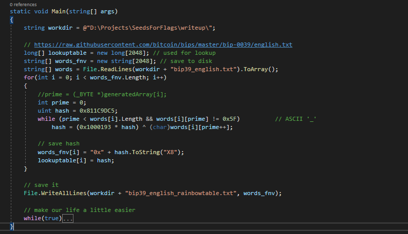

# Solving!

To make my task a little easier I added a few extra lines of C# code to the solution so I can now enter a hash in the console which it then looks up and gives me the correct `BIP-39` word.

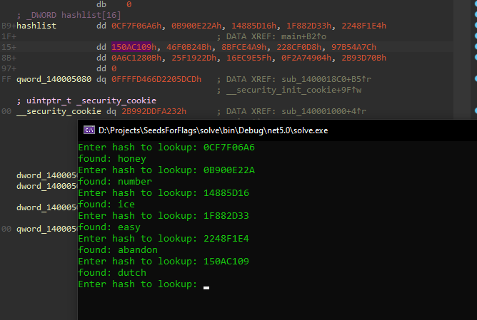

Once all hashes were reversed, I simply entered them all in the application (separated with spaces, as seen during reversing) and hit enter.

We then received the following message containing the flag, cheers!

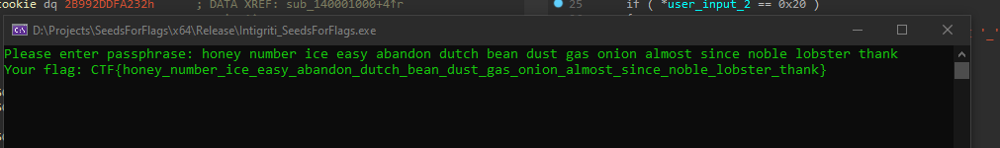
