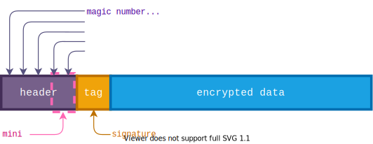

# Conversationalist

> Alice and Bob are having a conversation, do you want to join in on the fun and grab the flag?

## Summary

In cocoon version 0.3, there exists a vulnerability when you reuse the `cocoon` object to encrypt multiple messages. The **nonce is reused** for each message allowing you to break the AES-GCM encryption from cocoon to forge your own tags for an arbitrary ciphertext. Alter any ciphertext slightly to let the application decrypt it and know the plaintext, after which you can computer the keystream and encrypt a "Give me the flag" plaintext with the correct tag. Finally, decrypt the resulting flag using the keystream found earlier.

## Writeup

This challenge has a remote TCP server that you may connect to, and eventually extract a flag from. It also gives the full source code in a `main.rs` file for logic, a `Cargo.toml` file for dependencies, and a `Dockerfile` for the environment setup.

### Source Code Analysis

Let's have a look at each file, starting with the biggest, `main.rs`:

```rs
use cocoon::MiniCocoon;
...

fn write_message(plaintext: &str, cacoon: &MiniCocoon) {
    let mut data = plaintext.to_owned().into_bytes();
    let detached_prefix = cacoon.encrypt(&mut data).unwrap();
    println!("< {}:{}", hex(detached_prefix), hex(data));
}

fn read_message(cocoon: &MiniCocoon) -> Result<String, Box<dyn error::Error>> {
    ...

    if let Some((detached_prefix, ciphertext)) = input.split_once(':') {
        let detached_prefix = hexhex::decode(detached_prefix.trim()).map_err(|_| "Prefix is invalid hex")?;
        let mut ciphertext = hexhex::decode(ciphertext.trim()).map_err(|_| "Ciphertext is invalid hex")?;

        cocoon.decrypt(&mut ciphertext, &detached_prefix).map_err(|_| "Decryption failed")?;
        let data = String::from_utf8(ciphertext).map_err(|_| "Invalid UTF-8")?;

        Ok(data)
    } else {
        Err("Prefix and message must be separated by a colon.")?
    }
}

fn main() -> Result<(), Box<dyn error::Error>> {
    let key = rand::thread_rng().gen::<[u8; 32]>();
    let seed = rand::thread_rng().gen::<[u8; 32]>();
    let cocoon = MiniCocoon::from_key(&key, &seed).with_cipher(cocoon::CocoonCipher::Aes256Gcm);

    println!("Conversation:");
    let messages = include_str!("../messages.txt").lines().collect::<Vec<_>>();
    for message in &messages {
        write_message(message, &cocoon);
    }

    println!("\nJoin in on the conversation! Make sure your message is encrypted and uses the same format.");
    let input = read_message(&cocoon)?;
    println!();

    if messages.contains(&input.as_str()) {
        println!("Why did you repeat that message?");
    } else if input.contains("Give me the flag") {
        println!("Since you asked so nicely, here is your flag:");
        write_message(include_str!("../flag.txt"), &cocoon);
    } else {
        println!("You said: {input:?}");
    }

    Ok(())
}
```

In the `main()` function, it randomly generates a `key` and `seed`, it seems safe so far. These are put into `MiniCocoon::from_key`, [a library](https://crates.io/crates/cocoon) that performs encryption on a given text. We will look more deeply into this later.  
After initialising, some messages from "messages.txt" are read, which will be different on the remote server. Each message is encrypted using `cocoon` and output.  
Lastly, we are given a chance to send our own message which is read in the same format as the sent messages. The message is then decrypted by `cocoon` and if it contains "Give me the flag", the flag is sent encrypted as well.

The dependencies in `Cargo.toml` are sparse, just three of them. The `cocoon` library we saw earlier, the most popular [hex encoder/decoder](https://crates.io/crates/hex), and the most popular [random generator](https://crates.io/crates/rand):

```toml
[package]
name = "conversationalist"
version = "0.1.0"
edition = "2021"

[dependencies]
cocoon = "0.3"
hex = "0.4.3"
rand = "0.8.5"
```

Lastly, we have the Dockerfile containing nothing special. It just builds and runs the Rust program over a TCP server:

```Dockerfile
FROM rust:latest

RUN apt update && apt install -y socat

WORKDIR /app
COPY app .

RUN cargo install --path .

EXPOSE 1337

CMD ["socat", "TCP-LISTEN:1337,reuseaddr,fork", "EXEC:conversationalist,stderr"]
```

### Cocoon

At some point, we must send a message that contains our "Give me the flag" string, but it must be decryptable by `cocoon`. Let's have a look at how this encryption library works.

From the documentation, it should have the following format:



The mini header will have an _encryption nonce_ and a _data length_, after which comes the _tag_ (signature), and finally the _encrypted data_. Let's see what that looks like when connecting to the server:

```shell
Conversation:
< 004cda7e527d41e52ed5132000000000000000ac4c2c606cd073dbf05d401f1e31122e76:65906bd09cfd69b68ab22f500e1abb95e1f1e5fe823fa568866500030a22dc99af7c30419be9b007aaa377288215d32b29500d6f6f8eb78726287ea5c770dd536e069cdb5e5067cf2ff93307e70b5a3e6cf172198f6ec4a18ba65df894fbeda8c2dcdd8bc9da5d076734d591d10548dc13335744ee50dd4d1761650962cc3467a91fce498b302a2c1a7f248ea3a6f5ba7bc174c624296fe39dde2be1f9c3db008143d9d7b49bd1e3637fe2c7
< 004cda7e527d41e52ed5132000000000000000a26f2ce5542e3f26aacc9b4fd4b4dd840a:7d906096bbf17fb68a99364a195fe2d4dce4edff8223af3a80264e0b0c70d8caa86134469bffa100b9aa3b67ce2d9b3d6c4143796dd7a69d2b6763e0c864d6533c1ad2884f5d6fcf2be47c11ed48423d30ba5e018d3cdbb982b85ffac7e4eebe858f9c82c29570007e3fd59bc7510dd302671201f341d14718722c1264897b61e81cd31a863f25694c79398ab5a3f5aa30c15bc1236c2eee9f9a7ffaf18cc61d8e05
< 004cda7e527d41e52ed51320000000000000009b1382a99174aef60b1bf92e67e5637482:6a9a7d94fee664bac2bd3b515b1a8580a8f6a0e8c72db82d9662070b0470c5d6fb7c3043debea64fb5a3232187179478384c4c6e38ddf68b2d7c65e0d570c655254993954e18718a3cfe2e16a64867372fb45a0d8f6e9db982bc47bfc0feefa289d898ccd1d04b42283e909dc44c43d557641310f515cc4c1675205d66c87368b151dc5f91382720597d3f8abca4e3f13eaf7ccf287d63ee839b7e
< 004cda7e527d41e52ed5132000000000000000b20ecf18d2fd4972324a7a2e6cb001badc:629d3ed0bafd65bddef828461753a290afe8e5bb821fa221962a1d001725c199b2677159d2f5b000b9e6333b8b189e782e5d0d7970c3a68830617eafca2b8f66221c81d70a566dcf2dea3217e705153630be47009f68cef58cbd13f2dde4efa6ddcc9589d5954a48283c948e84055ada1e701244f446984c0c6120532ae87a76e818c453973820251a68238ca6adf8ba6dc17ac6606161f8d1972baeefc3c108884fc19ea99596f86c77f494dc286097788f
< 004cda7e527d41e52ed5132000000000000000b032055885cc3e676f970a732492977522:6c966685bffe67e386f813031e53a8d4eea5f1efcb28a168916f1d114f70d0d7bf3438419cedf548b7aa3320801ed32d3c0444776fdcb39a31617ba5c87c8f412b059ed50a7d748a31ab2b1afc0015212dbc524f8f64c9a782ef40f6d9e2eea6ddca99ccd2c758416e3396d088405bd7056a0e0cf45bdf040a7224046fcd347cbc10c856867f61001a68238abda1b0b97bc667cd606e61e095de2be6bc90dd08945f8d84a493dae46c74b195932b61d7
< 004cda7e527d41e52ed5132000000000000000ae00bf8cc17edc9782eeaa72b7d0ac2aa8:799d7384f9e12bfbddbd294c175fec9aeaf2f3bb8207af3cc2794e080c3ed8cdb466715ccfbeb34faae636698c108778204b437d7adcfac9207d79e0ed25c757380cd29a0a5e678a33e23214a81c5d3b31f15a068d74c9f585a65dfed8fbfbe7cbcadd98ced0195467368088c14a439200765d12f815da411c68650a6bc06066a6168a5c8c236f696e742a8db8b9b0a8719335c92c652ef69e8b2da9ef86dd1c960bda98b5999aad437ff8859965

Join in on the conversation! Make sure your message is encrypted and uses the same format.
>
```

The messages do appear to be in a certain format. Comparing them, we see the start is always the same, and a part before the colon is always different. In the middle there seem to be a lot of `0` characters, a keen eye may recognize this as the length of the message. We can divide the message into these parts:

```
004cda7e527d41e52ed5132000000000000000b032055885cc3e676f970a732492977522:6c9...1d7
004cda7e527d41e52ed5132000000000000000ae00bf8cc17edc9782eeaa72b7d0ac2aa8:799...965
^^^^^^^^^^^^^^^^^^^^^^^^ (24)           ^^^^^^^^^^^^^^^^^^^^^^^^^^^^^^^^^ (32)
                        ^^^^^^^^^^^^^^^^ (16)
```

Looking at the [source code of `cocoon`](https://docs.rs/cocoon/0.3.3/src/cocoon/format.rs.html), we find how `MiniFormatPrefix` uses `MiniCocoonHeader` to serialize the first two parts, being the 12-byte _nonce_ and 8-byte _length_ respectively. Then, it adds a 16-byte _tag_ at the end when serializing.

```rs
const MINI_HEADER_SIZE: usize = 20;
const TAG_SIZE: usize = 16;

impl MiniFormatPrefix {
    ...
    pub fn new(header: MiniCocoonHeader) -> Self {
        let mut raw = [0u8; MINI_SIZE];

        header.serialize_into(&mut raw);

        MiniFormatPrefix { header, raw }
    }

    pub fn serialize(mut self, tag: &[u8; TAG_SIZE]) -> [u8; Self::SERIALIZE_SIZE] {
        self.raw[MINI_HEADER_SIZE..MINI_HEADER_SIZE + TAG_SIZE].copy_from_slice(tag);
        self.raw
    }
}

impl MiniCocoonHeader {
    ...
    pub fn serialize_into(&self, buf: &mut [u8]) {
        debug_assert!(buf.len() >= Self::SIZE);
        let length = u64::try_from(self.length).expect("Data too large");

        buf[..12].copy_from_slice(&self.nonce);
        buf[12..Self::SIZE].copy_from_slice(&length.to_be_bytes());
    }
}
```

Looking back at the messages we receive from the application, it is interesting that the first part which is supposed to be a nonce, is the same for every message! The "number used once" should be unique for each encryption. Why does this happen?

You may have noticed that version 0.3 is used instead of the latest version 0.4 of cocoon, this is because this older version contains a vulnerability:

["Sequential calls of encryption API (`encrypt`, `wrap`, and `dump`) result in nonce reuse"](https://github.com/advisories/GHSA-6878-6wc2-pf5h)

In their words, sequential calls to `encrypt` on the same Cocoon object will result in nonce reuse. In the source code of this application, a cocoon object is created at the start which has multiple `encrypt` calls done without recreating the object. This makes it vulnerable to the advisory, but how can we abuse it?

One part we should look at is how encryption is done, and where the nonce comes into play.

```rs
pub fn encrypt(&self, data: &mut [u8]) -> Result<[u8; MINI_PREFIX_SIZE], Error> {
    let mut rng = self.rng.clone();

    let mut nonce = [0u8; 12];
    rng.fill_bytes(&mut nonce);

    let header = MiniCocoonHeader::new(nonce, data.len());
    let prefix = MiniFormatPrefix::new(header);

    let nonce = GenericArray::from_slice(&nonce);
    let key = GenericArray::clone_from_slice(self.key.as_ref());

    let tag: [u8; 16] = match self.config.cipher() {
        CocoonCipher::Chacha20Poly1305 => {
            let cipher = ChaCha20Poly1305::new(&key);
            cipher.encrypt_in_place_detached(nonce, prefix.prefix(), data)
        }
        CocoonCipher::Aes256Gcm => {
            let cipher = Aes256Gcm::new(&key);
            cipher.encrypt_in_place_detached(nonce, prefix.prefix(), data)
        }
    }
    .map_err(|_| Error::Cryptography)?
    .into();

    Ok(prefix.serialize(&tag))
}
```

As seen in the above function, `self.rng` is insecurely cloned as the advisory explains. The cipher in our case is `Aes256Gcm`, which calls into the [`aes_gcm` library](https://docs.rs/aes-gcm/latest/aes_gcm/) to do the dirty work. This is a standard and well-known form of encryption, so let's figure out what can happen if the nonce is reused.

### Nonce reuse

Searching online for "AES GCM nonce reuse" quickly yields people asking the same question. [This answer](https://crypto.stackexchange.com/a/68525) provides a brief summary of why it is a problem. Firstly, the plaintexts of the messages are at risk because the keystreams are the same for each ciphertext. The ciphertexts XORed with each other equal the plaintexts XORed with each other. Such a "Multi-Time Pad" is often easily broken manually. Second, the integrity of messages is also at risk because, through some clever math, you can compute the authentication key used to calculate the tag for AES GCM.

These will help achieve our goal, as we need to forge a valid tag of the "Give me the flag" message, and afterwards, decrypt the flag in the response.

The following post is one I highly recommend you read, phenomenally explaining all the details of how to perform a nonce reuse attack on AES GCM:

https://frereit.de/aes_gcm/

As read in the post, the hardest part is recovering `y0` and `H`. The Cantor-Zassenhaus algorithm can solve a certain polynomial equation that we can set up using two sample messages. The result of finding "roots" using this algorithm are candidates for `H`, from which `y0` can be calculated as well. We then use a third sample message to generate tags until one matches our sample. With all we need to forge authentication tags, we can take any ciphertext and authenticate it to send to the application.

With the theory behind us, let's get started on implementing it in code. The Cantor-Zassenhaus algorithm was already implemented by frereit in [`factorize.rs`](https://github.com/frereit/frereit.github.io/blob/main/wasm/cantor-zassenhaus/src/factorize.rs) and [`f128.rs`](https://github.com/frereit/frereit.github.io/blob/main/wasm/cantor-zassenhaus/src/f128.rs). Together with the logic in [`aesgcm_widgets.js`](https://github.com/frereit/frereit.github.io/blob/main/static/js/aesgcm_widgets.js), we can start to recreate a whole script that recovers the authentication key and tags any ciphertext we throw at it.

### Implementation

#### 1. Getting Started

Because the existing work is implemented in Rust, I will continue to do so for tagging a ciphertext. Using `cargo new solver` we can create a new project, and add both existing source code files together into [`cantor_zassenhaus.rs`](src/cantor_zassenhaus.rs). Then in the main file, we can get started on interacting with the algorithm the way the post explained. Some things to know about the custom structs:

-   `F128Element` is a 16-byte integer with useful functions for making calculations in `GF(2^128)`. Addition is XOR (⊕), and multiplication is more complicated (⨂).
-   `F128Polynomial` is a polynomial of `F128Element`s, also with custom functions that make it easy to do calculations in this special way of calculating.
-   Functions like `factor()`, `square_free_factorization()` and `distinct_degree_factorize()` exist to find specific solutions to a polynomial equation as required by the idea presented in the post.

#### 2. Calculating coefficients for polynomial

Following ["Putting it all together"](https://frereit.de/aes_gcm/#putting-it-all-together), the first step is splitting the ciphertexts into blocks. Note that this includes _associated data_, which the post doesn't use but is important in our case:

```rs
// Function definition in `aes_gcm`
fn encrypt_in_place_detached(
    &self,
    nonce: &Nonce<NonceSize>,
    associated_data: &[u8],
    buffer: &mut [u8],
)

// Calling function in `cocoon`
CocoonCipher::Aes256Gcm => {
    let cipher = Aes256Gcm::new(&key);
    cipher.encrypt_in_place_detached(nonce, prefix.prefix(), data)
    //                                      ^^^^^^^^^^^^^^^
    //       Notice the prefix is passed as associated_data
}
```

This `prefix` is the mini header before the tag, so the nonce + length. We can get the nonce from any other message, and calculate the length of the ciphertext easily. Now splitting a message into blocks is just splitting the associated data and ciphertext separately into 16-byte blocks, followed by both of their lengths as 8-byte integers.

```rs
pub fn split_ciphertext(ad: &[u8], ct: &[u8]) -> Vec<[u8; 16]> {
    let mut res = ad
        .chunks(16)
        .chain(ct.chunks(16))
        .map(|x| {
            let mut block = x.to_vec();
            block.extend_from_slice(vec![0; 16 - x.len()].as_slice());
            block.try_into().unwrap()
        })
        .collect::<Vec<_>>();

    let mut length_block = (ad.len() * 8).to_be_bytes().to_vec();
    length_block.extend_from_slice(&(ct.len() * 8).to_be_bytes());

    res.push(length_block.as_slice().try_into().unwrap());

    res
}
```

We will take two messages from the application's output and take both parts out, splitting them into blocks. To make them easier to work with in the future, we will parse each message into a `Message` struct:

```rs
#[derive(Clone, Debug)]
pub struct Message {
    pub tag: [u8; TAG_SIZE],
    pub associated_data: Vec<u8>,
    pub ciphertext: Vec<u8>,
    pub blocks: Vec<[u8; 16]>,
}
impl FromStr for Message {
    type Err = String;

    fn from_str(s: &str) -> Result<Self, Self::Err> {
        let (prefix, message) = s.split_once(':').ok_or("Failed to split message")?;
        let header = hexhex::decode(prefix).map_err(|_| "Failed to hex decode header")?;
        let ciphertext = hexhex::decode(message).map_err(|_| "Failed to hex decode ciphertext")?;

        let (mini_header, tag) = header.split_at(MINI_HEADER_SIZE);
        let tag = tag.try_into().map_err(|_| "Failed to parse tag")?;
        let blocks = split_ciphertext(mini_header, &ciphertext);

        Ok(Message {
            tag,
            associated_data: mini_header.to_vec(),
            ciphertext,
            blocks,
        })
    }
}

fn main() {
    let m1: Message = "d01299ae8cf5fab89c36dcaf00000000000000ac8b864666826f0cfdab2fc26a4fb6f0ac:d7fe7589ece0a3d9203c48b519f5b0a7af3104c9bb001ac81f89320dc6e1a5594b46971f2728f82f08492ca4ccddc30ed81405af668b6e3d4a9733bd0468b38a9162ee0a2fa2089a53081958fa9b92662213699e28527990b622b76ec1aa1550545029b5913f8012c6926ac0fdc282a61f0523dc427b0231f689ffceec8d366b3d263bb38493f0bedcee6f3e983a2adefdf4b0e1d4da9322f87a4305db29e344ee70da3352338bea63b782f2"
        .parse().unwrap();
    let m2: Message = "d01299ae8cf5fab89c36dcaf00000000000000a2f585635be9b588692c5b2c7ca58f20ec:cffe7ecfcbecb5d9201751af0eb0e9e692240cc8bb1c109a19ca7c05c0b3a10a4c5b9318273ee9281b4060eb80e58b189d054bb964d27f2747d82ef80b7cb88ac37ea0593eaf009a5715564ef0d88a657e5845862a006688bf3cb56c92b51646130368bc9a70ad15df996acaeb96c7a90e5166995f6a0e3bf99ab6d5eac8796d7c2526e0899cfffb8ae8723a8e3f2aceb6f49fe6d39fd22ffa3e171ed366fe59e136"
        .parse().unwrap();

    for block in &m1.blocks {
        println!("{}", hex(block));
    }
}
```

Output:

```
d01299ae8cf5fab89c36dcaf00000000
000000ac000000000000000000000000
d7fe7589ece0a3d9203c48b519f5b0a7
af3104c9bb001ac81f89320dc6e1a559
4b46971f2728f82f08492ca4ccddc30e
d81405af668b6e3d4a9733bd0468b38a
9162ee0a2fa2089a53081958fa9b9266
2213699e28527990b622b76ec1aa1550
545029b5913f8012c6926ac0fdc282a6
1f0523dc427b0231f689ffceec8d366b
3d263bb38493f0bedcee6f3e983a2ade
fdf4b0e1d4da9322f87a4305db29e344
ee70da3352338bea63b782f200000000
00000000000000a00000000000000560
```

First comes the 12-byte nonce, directly followed by the length which wraps around to the 2nd block as `ac` (172). Then comes the ciphertext itself split into 16-byte blocks, padded with 0s to fit the last block. Finally, the length of the associated data (`a0`) and ciphertext (`560`) in bits. We do the same for the second message and can begin calculating the coefficients for the polynomial by XORing the blocks together. While doing so, we will convert them to `F128Element`s and add those to do our XOR operation.

```rs
let mut coefs = vec![];
for (block1, block2) in m1.blocks.into_iter().zip(m2.blocks.into_iter()) {
    coefs.push(F128Element::from_block(block1) + F128Element::from_block(block2));
}

println!("{:?}", coefs);
```

Output:

```rs
[F128Element(0), F128Element(1879048192), F128Element(173602557326962360542807100630217261080), F128Element(268671717157330888019587321280523708604), F128Element(138333744848918408033346115478566779104), F128Element(1080828108078553644554646379251796130), F128Element(255340331473504663601324924218259945546), F128Element(139241678620025452405464903706010243642), F128Element(319856731205154492284417525511675366114), F128Element(128865716858402959222222637305407089288), F128Element(10637077401671230713359907908172169346), F128Element(245538243524069311590027402087291420882), F128Element(24529018813801041599080915696), F128Element(18609191940988822220653298843924824064), F128Element(2718742238092547827598363604835156094)]
```

We also need to XOR the two tags together, and after reversing their order, put them into a polynomial equation:

```rs
coefs.push(F128Element::from_block(m1.tag) + F128Element::from_block(m2.tag));
coefs.reverse();
let poly = F128Polynomial::new(coefs);
```

#### 3. Find distinct degree polynomial equations

Using the prewritten functions `square_free_factorization()` and `distinct_degree_factorize()`, we can easily find all distinct degree polynomial equations. We only care about the first one:

```rs
let square_free = square_free_factorization(&poly);
let distinct_degree_factors = distinct_degree_factorize(&square_free);

let poly = distinct_degree_factors.first().unwrap().0.clone();
```

#### 4. Find roots of degree 1 polynomial using Cantor-Zassenhaus

The final step involves finding the roots of the equation. We do this by using `factor()` and converting each resulting polynomial into a single element by calling `.to_monic()` and extracting the first coefficient.

```rs
let factors = factor(&poly);
let zeros = factors
    .iter()
    .map(|x| x.to_monic())
    .flat_map(|x| x.0.first().cloned())
    .collect::<Vec<_>>();

println!("{:?}", zeros);
```

Output:

```rs
[F128Element(106071322765186037933926542767738858037), F128Element(262093153799055203780077156323823862698)]
```

In this case, it finds two possible `H` values. To test which it is, and compute new tags, we will implement the authentication algorithm and check it with a third message.

#### 5. GHASH & Authenticating Ciphertexts

This is the first step where we need to have the `GHASH()` function implemented. Luckily, this function is pretty simple with the `F128Element`s we already have. It goes as follows:


We start off at 0, then XOR the first block with it. Then, multiply that by H. Now XOR the second block and multiply by H again. Continuing until we have our result:

```rs
fn ghash(ad: &[u8], ct: &[u8], h: [u8; 16]) -> F128Element {
    let h = F128Element::from_block(h);
    let blocks = split_ciphertext(ad, ct);
    let blocks = blocks.into_iter().map(F128Element::from_block);
    let mut res = F128Element(0);
    for block in blocks {
        res = res + block;
        res = res * h;
    }
    res
}
```

For each possible `H`, we calculate the first message's ghash and XOR it with the first message's real tag. This finds us `y0`.  
Next, we calculate the third message's ghash and XOR it with the `y0` we just found, which should equal the real tag of the third message. If it does, we found our correct `H` and `y0` to authenticate any other ciphertext.

```rs
let (h, y0) = zeros
    .into_iter()
    .find_map(|h| {
        let first = ghash(&m1.associated_data, &m1.ciphertext, h.to_block());
        let y0 = F128Element::from_block(m1.tag) + first;
        let third = ghash(&m3.associated_data, &m3.ciphertext, h.to_block());
        let t3 = third + y0;
        (t3.to_block() == m3.tag).then_some((h, y0))
    })
    .ok_or("Failed to find h and y0")
    .unwrap();

println!("H: {:?}", h);  // F128Element(106071322765186037933926542767738858037)
println!("y0: {:?}", y0);  // F128Element(106620797347653341411100128071857225977)
```

#### 6. Forge an authenticated ciphertext

As a proof of concept, we will authenticate a new ciphertext from scratch. We first need to create a mini header as the associated data, which will be the nonce together with the length. Then, we tag these by `ghash()`'ing the blocks and XORing with `y0`, which will be placed right after the mini header.

```rs
fn create_mini_header(nonce: [u8; 12], ciphertext: &[u8]) -> [u8; MINI_HEADER_SIZE] {
    let mut mini_header = nonce.to_vec();
    mini_header.extend_from_slice(&ciphertext.len().to_be_bytes());
    mini_header.try_into().unwrap()
}

fn create_tag(h: F128Element, y0: F128Element, mini_header: &[u8], ciphertext: &[u8]) -> [u8; TAG_SIZE] {
    let tag = ghash(mini_header, ciphertext, h.to_block()) + y0;
    tag.to_block()
}

fn main() {
    ...

    let nonce = m1.associated_data[..12].try_into().unwrap();
    let ciphertext = b"\x01\x02\x03\x04";

    let mini_header = create_mini_header(nonce, ciphertext);
    let tag = create_tag(h, y0, &mini_header, ciphertext);

    println!(
        "{}{}:{}",
        hex::encode(mini_header),
        hex::encode(tag),
        hex::encode(ciphertext)
    );
    // d01299ae8cf5fab89c36dcaf00000000000000040fbc124e3fe10cccec836ddc812576ce:01020304
}
```

To show that this really works, we can now give this forged message to the application to receive an error about UTF-8 decoding:

```shell
Join in on the conversation! Make sure your message is encrypted and uses the same format.
> d01299ae8cf5fab89c36dcaf00000000000000040fbc124e3fe10cccec836ddc812576ce:01020304
Error: "Invalid UTF-8"
```

The message successfully decrypted, the only problem is that it is still not a valid UTF-8 string because we set the `ciphertext` randomly to `\x01\x02\x03\x04`, making the plaintext completely random bytes.

### Getting the Flag

Our final goal is to read the flag, for which we first need to send a "Give me the flag" message. We can now authenticate arbitrary ciphertexts, but how do we get the ciphertext of our new message?

The application cannot do this for us, we need to apply the keystream ourselves. If we know any part of the first message's plaintext, we could XOR that with the ciphertext to get that bit of keystream. Fortunately, the application will send us a "You said: " response if your message is unique. By taking one of the ciphertexts we receive, and blindly altering one of its bytes in hopes that it stays valid UTF-8, we can generate a unique message that is still almost the whole original ciphertext. This will decrypt to the first message's plaintext, exactly what we want.

We will flip the last byte to something different, which we can later flip back on the plaintext to get the full original message.

```
Original: 659...2c7
Altered:  659...2c6
```

Authenticating this ciphertext, and sending it to the application, we receive the following response:

```shell
Join in on the conversation! Make sure your message is encrypted and uses the same format.
> 73582d64a3608ac2dd20b13800000000000000aca79d51a37a9a82e36da5779aa8d05379:6cce47b22327dd9810b08569ef83a9d8e12450234286ed7f77ee6358b6ec953e2d056e520b5b8431c881d188685383afe383818ccb3a2572fc940bfa7cd7af5d17b0ea1534cf378e2c684dd9de30e502ecedfbea7580b3b685c9e9b2db09a31a72117b8022226a18ada89688e6c6fc1a96d304212f88fdc16796c1c74712b3cda3f3f625a791610b0150b45b9876f5355b917605677db55be4149fae64041a72499b1a88ed22c8f16e53df78

You said: "Hey Bob, just wanted to confirm that we're all set up and secure on the protocol. Everything looks good on my end - seeing the handshake complete and all the right signals "
```

XORing the last ` ` by 1 results in `!`, making the full first plaintext:

> Hey Bob, just wanted to confirm that we're all set up and secure on the protocol. Everything looks good on my end - seeing the handshake complete and all the right signals!

In our next run, we can easily get the whole keystream by XORing the first message's ciphertext with this leaked plaintext. Then, apply that keystream to the string "Give me the flag" and tag it. This will send us the flag.

```py
from pwn import xor

plaintext = b"Hey Bob, just wanted to confirm that we're all set up and secure on the protocol. Everything looks good on my end - seeing the handshake complete and all the right signals!"
ciphertext = bytes.fromhex("31b70a353970bcbd33d3dce5cd94ba0022e567d2e4d74e7c53299e91c8fdb8fe460115690a81863636330be1d2e3322736f35eeb8548729b233864b974123ce166a770672c3b2c5ddf243fe2ce973156ebf23f3345696d600ed6d56cc9fb07861cbf711268a234b4caf87121517d37614d1cb5b660b3f28b2c9b9775cf3a8378d4d8dc034114edec6ce4aef542f6c0c873a2e97dc1d9d2f275856a1ffdc4f6a182675a0dd5d8e3e14bba7b50")

keystream = xor(plaintext, ciphertext, cut="left")

target_plaintext = "Give me the flag"
target_ciphertext = xor(target_plaintext, keystream, cut="left")

print(target_ciphertext.hex())  # '3ebb05705b72bbb167d1ccb6dfd8ac06'

# Now use Rust solver to tag the above ciphertext
```

```shell
Join in on the conversation! Make sure your message is encrypted and uses the same format.
> e080fdcf43cb23779c2c2a1d0000000000000010244348b312c9fca74ad5292530b85bd8:3ebb05705b72bbb167d1ccb6dfd8ac06

Since you asked so nicely, here is your flag:
< e080fdcf43cb23779c2c2a1d00000000000000585d3fee63666aea76b6c6b380572d3100:3a86356e3870bda15cd7ffa5cbe7f91505a16c839be2536f1d31b8c3d5d08cee474e262e759ed74775386cace1be667366aa1daab90420b11856629155543cdb139b2d230763273e9c0916a6d3ab6a6597e14e3610753569
```

Finally, we need to decrypt this last message to read the flag. This is easy now that we have the keystream:

```py
flag_ciphertext = bytes.fromhex("3a86356e3870bda15cd7ffa5cbe7f91505a16c839be2536f1d31b8c3d5d08cee474e262e759ed74775386cace1be667366aa1daab90420b11856629155543cdb139b2d230763273e9c0916a6d3ab6a6597e14e3610753569")
flag = xor(flag_ciphertext, keystream, cut="left")

print(flag.decode())
# CTF{Coc0OnV3rS4tI0n5_Ar3-wH4t_Y0u'R3_h4V1nG,_1t'5-c4Ll3D_NuMB3r_US3d_0nC3_F0r_4_R34s0n!}
```

> **Note**: In this repository, a [`solve.py`](solve.py) script was written that interacts with a CLI version of the Rust solver to automatically perform all of these steps and recover the flag.

[OFFICIAL WRITEUP](https://github.com/JorianWoltjer/challenges/tree/main/1337up-live-2024/conversationalist/solve/WRITEUP.md)
